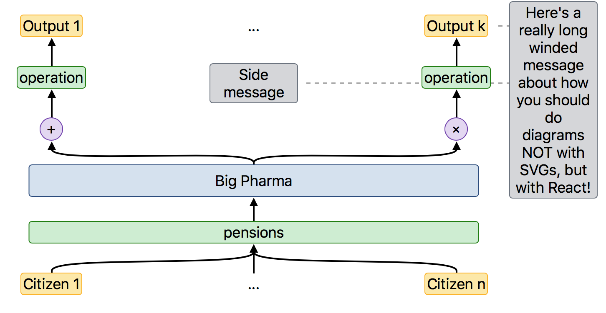
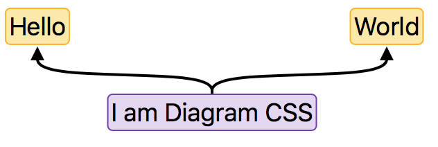

Diagram CSS
-----------

Build diagrams, neural network architectures, flow graphs, etc..
with D3 + React super easily:



[](https://github.com/JonathanRaiman/)
[](LICENSE.md)

Usage
-----

Using `lib.jsx` you now have a React Element called `Diagram`, it takes
a series of nodes that define some fields like position, class, name, text,
etc..., along with a special "parent" field. The parent field is a list that
will create arrows from the present node to all parent nodes with the correct
name.

### Example

```
var nodes = [
    [
        {
            "text": "Hello",
            "class": ["node-yellow"],
            "name": "hello",
            "position": {
                "left": "25%"
            }
        },
        {
            "text": "World",
            "class": ["node-yellow"],
            "name": "world",
            "position": {
                "left": "75%"
            }
        }
    ],
    [
        {
            "text": "I am Diagram CSS",
            "class": ["node-purple"],
            "name": "root",
            "position": {
                "left": "50%"
            },
            "parent": ["hello", "world"]
        }
    ]
];
ReactDOM.render(<Diagram nodes={nodes}
                         increment={30}/>, document.getElementById("diagram"));

```



Using this setup you can easily connect 3 nodes together. When you resize the page
the arrows will track changes in the position of the elements. You can create elements
that have overflowing content, variable sizes, etc... anything you would usually do
with divs + html, but with no the possibility of using d3 beautiful arrows to connect them.

#### Customizing edges

To customize edges add a field called `edge-class` that takes a list of classes that should
be used when creating a path leaving from the current node.


#### Working off this repository:

To update/tweak the current code, I have added a `build.sh` and a `package.json` file, you can then:

```
npm install
mkdir build
./build.sh
python3 -m http.server
```

Which should give you on localhost:8000 access to the diagram.
